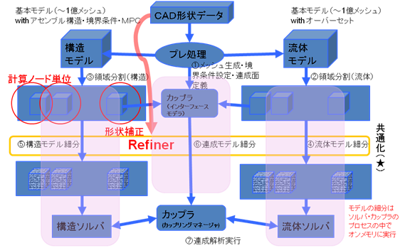
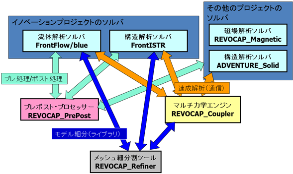

# REVOCAP_Refiner の設計と概念

## 概念

REVOCAP_Refinerは単体のソフトウェアではなく、ソルバーおよびカップラに組み込まれて使われるFEM解析モデルの細分を行うライブラリである。

## 目的

次世代スパコンの上で動作し、数100億要素の解像度の解析を目指すとともに、中規模のクラスタ環境での数億要素の解像度の解析を容易に実現できる環境を提供することを目的とする。

## システム構成

REVOCAP_Refiner はソルバーおよびマルチ力学エンジン（カップラ）に組み込まれて解析モデルの細分を行う。プレポスト・プロセッサーからは形状データ（ＣＡＤデータ）から生成されたモデル細分時の形状適合のための事前情報を受け取り、ソルバ内部でのモデル細分の時に利用する。このとき、ソルバおよびマルチ力学エンジン（カップラ）は形状適合情報については意識する必要はない。
REVOCAP_Refiner の内部でのメッシュの処理については REVOCAP_PrePost のメッシュ処理部と共通の機能が多いため（特に汎用的な幾何処理およびメモリ処理関係）、転用して利用する。

REVOCAP_Refiner はソルバおよびマルチ力学エンジン（カップラ）に組み込まれて解析モデルの細分を行う。プレポスト・プロセッサーからは形状データ（ＣＡＤデータ）から生成されたモデル細分時の形状適合のための事前情報を受け取り、ソルバ内部でのモデル細分の時に利用する。このとき、ソルバおよびマルチ力学エンジン（カップラ）は形状適合情報については意識する必要はない。
REVOCAP_Refiner の内部でのメッシュの処理については REVOCAP_PrePost のメッシュ処理部と共通の機能が多いため（特に汎用的な幾何処理およびメモリ処理関係）、転用して利用する。

## 開発対象

開発対象は以下のとおりとする
- メッシュデータ構造
- 幾何処理サブルーチン群
- 境界条件データの管理機能
- 要素細分機能
- 境界条件更新機能
- 形状適合機能
- C言語およびFortran言語からのインターフェイス

## 要求仕様

## 設計仕様

### 関数呼び出し規約

1. REVOCAP_Refiner はソルバまたはカップラに組み込まれてそのプロセスの中で実行される（フォークしない）。新たなプロセスを起動してプロセス間通信でデータのやり取りをするのではなく、ソルバやカップラのプロセスの中で、関数を通じてデータのやり取りをする。
1. 関数への入力や出力となる変数のメモリ管理は呼び出し側が責任を持つ。ソルバやカップラへ受け渡さない REVOCAP Refiner の内部データは REVOCAP_Refiner がメモリ管理について責任を持つ。
1. REVOCAP_Refiner のメモリ空間は呼び出されるプロセスの中で一意である。同じプロセスの中で複数の REVOCAP_Refiner の処理を行う場合は、現バージョンでは未対応である。初期化と終了を正しく使わない場合はデータが破壊される場合があるので注意が必要である。

### 関数命名規約

1. 名前は rcapXXX とする。
1. FORTRAN77 および Fortran90 の呼び出しのための関数名の変換はラッパ関数を経由することで行う。ビルドする場合には、呼び出す Fortran のコンパイラの種類によってライブラリのコンパイル時に異なるMACRO定数を与えなければならない。MACRO定数 FORTRAN90 に対応するコンパイラ：gfortran, Intel Fortran, PGI Fortran

### メモリ管理規約

1. 配列の受け渡しは呼び出し側で allocate して、このモジュールでは allocate も free もせず、要素に代入するだけとする。配列があふれた場合はエラーコードを返す。

### 定数規約

1. 要素の型を表す RCAP_TETRAHEDRON, RCAP_TETRAHEDRON2, RCAP_HEXAHEDRON など C 言語で使う場合は、この rcapRefiner.h を include する。Fortran 言語で使う場合は rcapRefiner.inc を include する。

### 型規約

1. UNIX 標準 C の stdint.h および、浮動小数点についても同様の定義をする。
1. unsigned 型は Fortran で定義できない場合があるため使わない。
1. C 言語の size_t 型はコンテナの大きさをあらわす数として使うが、Fortran ではラッパーで符号付きに変換して使う。size_t 型は Fortran からは 32bit 整数にキャストした値として得られる

### 引数規約

1. 引数は入力系を前に、出力系を後ろにする
1. 配列の入力を与える時は、配列の大きさと先頭アドレスを与える
1. 要素の型など、他の情報で配列の大きさが決まる場合は、配列の大きさは省略する
1. 出力で配列を用いる場合は、あらかじめ allocate された配列に値を代入することで行う
1. 戻り値はエラー処理、出力で配列を用いた場合の値を代入した個数のために使う

### 要素配列規約

細分する要素の節点配列の順番はソルバ、カップラごとに異なる可能性があるが、ここでは革新プロジェクトにおける REVOCAP で用いた順番に従うことにする。
また節点配列の順番や、面番号の付け方については定数配列として、ソルバ、カップラ、および Refiner で共有し、適宜参照できるものとする。
